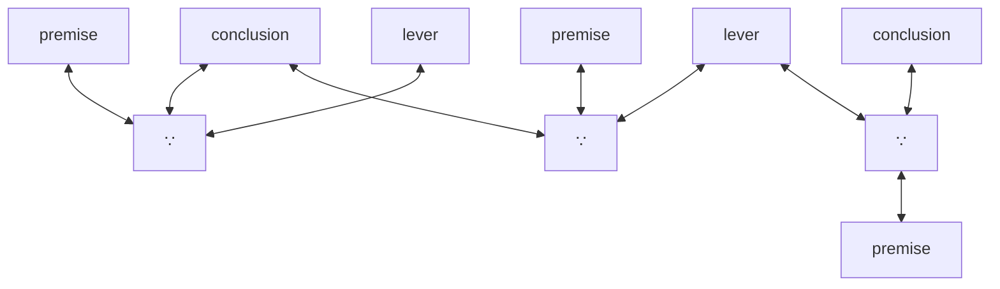

```mermaid
flowchart TB

k1[∵]
k2[∵]
k3[∵]
c1[conclusion]
c3[conclusion]
p1[premise]
p2[premise]
p3[premise]
l1[lever]
l2[lever]

  c1<-->k1
  p1<-->k1
  l1<-->k1

  c1<-->k2
  l2<-->k2
  p2<-->k2

  l2<-->k3
  c3<-->k3
  k3<-->p3


```
